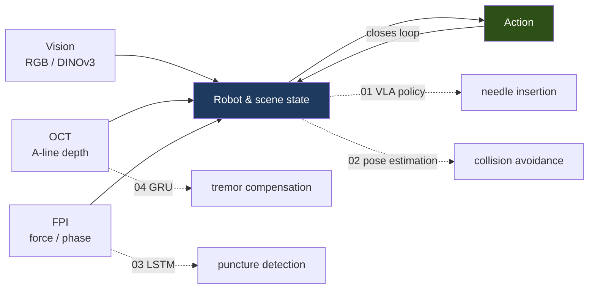
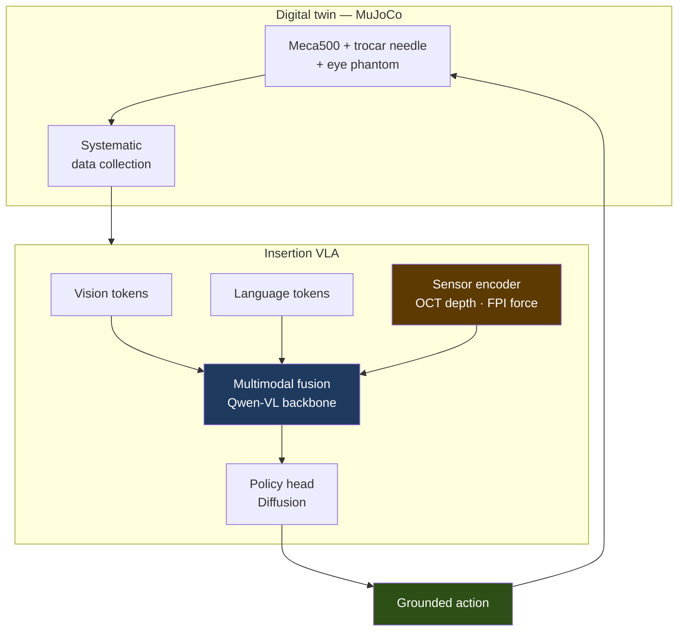
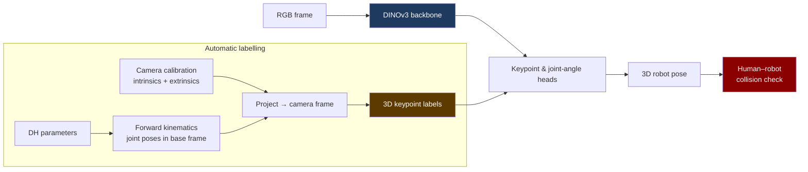
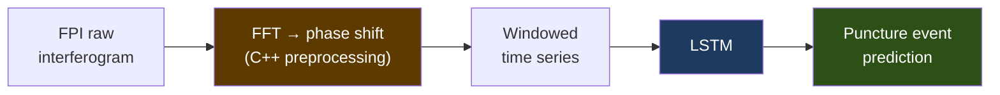
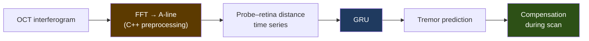

# Portfolio — Jongyeol Na (나종열)

Researcher at **KIRO** (Korea Institute of Robotics &amp; Technology Convergence), AI Task Intelligence.
M.S. from DGIST, Intelligent Robot &amp; Opto-Mechatronics Lab.

📧 [nagus1999@dgist.ac.kr](mailto:nagus1999@dgist.ac.kr) ·
📄 [CV](CV.md) ·
💻 [github.com/Najongs](https://github.com/Najongs) ·
📚 [Knowledge graph](https://najongs.github.io/knowledge-vault/)

> Diagrams render natively on GitHub — no image assets required.

---

## Overview

Four projects, one thread: **make a robot act precisely where vision alone cannot tell you
what is happening.** Each adds a different sensing modality to the loop.

| # | Project | Venue | Role | Core |
|---|---|---|---|---|
| 01 | Multimodal VLA for precise needle positioning | KRoC 2025 | **1st author** | Qwen-VL + OCT/FPI fusion, Diffusion policy, MuJoCo |
| 02 | Human-robot collision avoidance via 3D pose | IEIE 2025 | **1st author** | DINOv3 keypoints + FK + PnP |
| 03 | Epidural force-sensing needle precision | IJO 2026 (SCIE) | 2nd of 5 | FPI phase-shift + LSTM |
| 04 | Handheld confocal endomicroscope, tremor compensation | IROS | 2nd of 5 | OCT A-line + GRU |

---

## Project 01 · Multimodal VLA for precise robotic needle positioning

**KRoC 2025 · first author · M.S. thesis topic**

**Goal.** Automate tasks that require inserting a needle — spinal injection, intraocular
injection, blood draw — where millimetre error matters and the tip's state is invisible
to a camera.

**Why it is hard.** VLA models generalise poorly to new robots and unseen tasks, and
precision insertion needs awareness of *physical interaction*, not just pixels. Collecting
real demonstrations at that precision is slow and expensive.

**Approach — simulation first.** Build a high-fidelity MuJoCo digital twin of a Meca500
arm and a trocar-needle insertion task on an eye phantom, then collect data and train
entirely inside it. A pretrained Qwen-VL foundation model is extended with a **sensor
encoder** that ingests OCT (depth) and FPI (force) signals; those fuse with the visual and
linguistic representations to produce physically grounded actions.

**Result.** The simulation-trained pipeline learns precise insertion behaviour for the
target task, suggesting digital-twin acquisition plus multimodal sensing is a scalable
route to autonomous precision manipulation in biomedical and microsurgical settings.

**Stack** MuJoCo · Python (Qwen-VL, Diffusion policy) · C++ (sensor acquisition)
**Repos** [`Insertion_VLA_Sim2`](https://github.com/Najongs/Insertion_VLA_Sim2) ·
[`Insertion_VLAv3`](https://github.com/Najongs/Insertion_VLAv3) ·
[`Qwen VLA + OCT/FPI`](https://github.com/Najongs/Qwen2.5-VL-3B-_OCT_FPI_Action_Model)

---

## Project 02 · Vision-based 3D robot pose for collision avoidance

**IEIE 2025 · first author · led as project owner**

**Goal.** Predict a robot's 3D joint configuration from vision so a human sharing its
workspace never gets hit.

**The real obstacle was labels.** No pipeline existed to generate supervised 3D pose
labels automatically. I built one: calibrate the camera, implement forward kinematics
from the robot's DH parameters to get every joint pose in the base frame, then use the
intrinsics to project those into camera coordinates — live, as data is captured.

With labels solved, a DINOv3 foundation backbone plus keypoint and joint-angle heads
does the estimation, with 2D–3D PnP recovering the camera-to-robot transform.

**This line of work continued into [`DINObotPose`](https://github.com/Najongs/DINObotPose) `v1.0.0`** —
a released reproduction package that removes the ground-truth bounding box entirely: a
first pass fits the whole frame and projects its own solved skeleton to define the crop
for a second pass, then iterative fitting recovers joint angles and camera pose together
through differentiable forward kinematics. One configuration, every camera, both robots.

**Stack** Python (DINOv3) · robot kinematics · camera calibration · 2D–3D PnP
**Repos** [`DINObotPose`](https://github.com/Najongs/DINObotPose) ·
[`DIP_ROBOTPOSE`](https://github.com/Najongs/DIP_ROBOTPOSE) ·
[`Robot_joint_inference`](https://github.com/Najongs/Robot_joint_inference) (2024, DH + regression origin)

---

## Project 03 · Precision of an epidural force-sensing needle

**International Journal of Optomechatronics 20(1), 2026 · SCIE · 2nd of 5 authors**

A Fabry-Pérot interferometer at the needle tip reports force optically. The signal that
matters is buried in phase, and tissue puncture is a transient — so the problem is both
signal processing and time series.

**My contribution** — FPI sensor data analysis and the ML model.
**Stack** C++ (FFT phase-shift computation) · Python (LSTM)

---

## Project 04 · Tremor compensation for a handheld confocal endomicroscope

**IROS · 2nd of 5 authors**

Probe-based confocal laser endomicroscopy (pCLE) of the retina is done by hand, and hand
tremor corrupts the scan. Predict the tremor from OCT distance measurements and
compensate before it lands in the image.

**My contribution** — tremor data analysis and the ML model.
**Stack** C++ (FFT A-line computation) · Python (GRU)

*Also presented in Korean at ICROS 2025 (제40회 제어로봇시스템학회 학술대회) as a
non-contact handheld system with optical distance control.*

---

## Graduate coursework

| Course | Topic | Practice |
|---|---|---|
| Advanced Deep Learning | Data-hungry / General / Efficient / Trustworthy AI | Implemented and reviewed **RT-1**, **RT-2**, **ALOHA** |
| Robot System Implementation | Isaac Sim manipulator control | URDF modelling, ROS teleoperation (master–slave), Isaac Sim control |
| Computer Vision | 3D vision-based robot pose estimation | ROI extraction → 3D robot + hand coordinates → collision detection |
| Robot AI | Hand-eye calibration, multi-frame control | Hand-eye calibration; **Rodrigues network** to improve an existing pose model; Lie theory |

---

## How I keep research

Every claim carries the evidence that supports it; refuted approaches stay on the record
rather than being deleted; open questions are nodes, not TODOs.

A public extract is browsable at
**[najongs.github.io/knowledge-vault](https://najongs.github.io/knowledge-vault/)**.

---

Last updated 2026-09-15 · source: [`PORTFOLIO.md`](PORTFOLIO.md)
