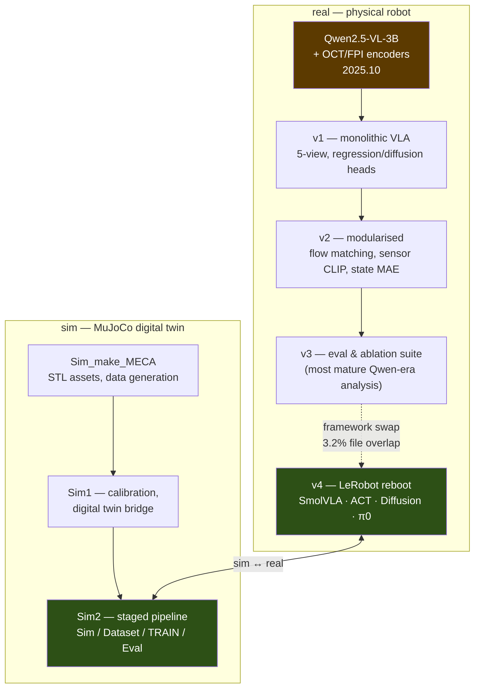
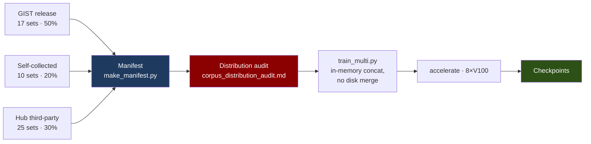
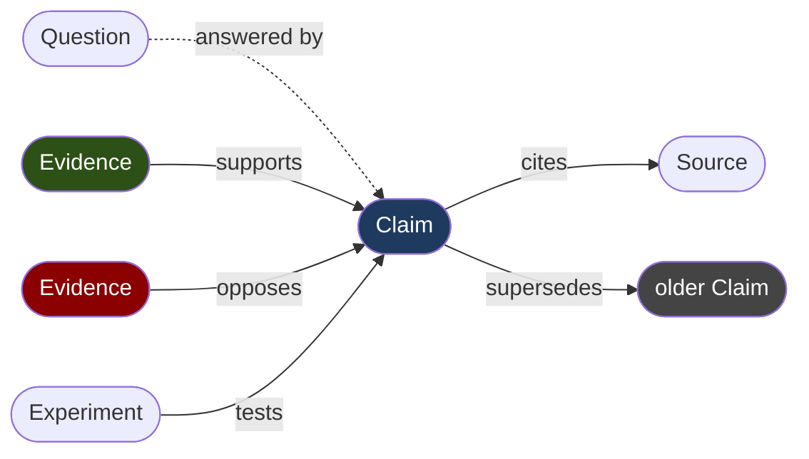

# Portfolio — Jong-Yeol Na

Four threads of work, each with the repositories that hold it.
Diagrams render natively on GitHub; no image assets required.

📧 [nagus1999@dgist.ac.kr](mailto:nagus1999@dgist.ac.kr) ·
📄 [CV](CV.md) ·
📚 [Knowledge graph](https://najongs.github.io/knowledge-vault/)

---

## 1 · DINObotPose — monocular robot pose &amp; joint angles

**Problem.** Recover the 6-DoF camera-to-robot transform *and* the joint angles from a
single RGB frame — with no encoder readings and no ground-truth bounding box.
Competing methods take the box from ground truth or an external detector; that makes
their numbers hard to compare and their pipelines hard to deploy.

**Approach.** Keypoints are read from a **frozen** DINOv3 backbone. A first pass fits the
whole frame, then *projects its own solved skeleton* to define the crop for a second
pass — so the pipeline produces the box it needs. An iterative fit then recovers joint
angles together with camera pose from those keypoints alone, minimising a robustly
weighted reprojection error through differentiable forward kinematics.

No depth model is trained, no weights are updated on the evaluated data, and **one
configuration serves every camera and both robots**.

**Release.** [`DINObotPose`](https://github.com/Najongs/DINObotPose) `v1.0.0` —
pinned dependencies, checkpoint SHA-256 manifest, `doctor.py` environment check, and
`reproduce_paper.sh`. The backbone architecture config ships in-package, so inference
needs no HuggingFace access.

**Lineage.** [`DINObotPose-v1`](https://github.com/Najongs/DINObotPose-v1) →
[`DINObotPose2`](https://github.com/Najongs/DINObotPose2) (Fourier domain adaptation) →
[`DINObotPose3`](https://github.com/Najongs/DINObotPose3) →
[`DIP_ROBOTPOSE`](https://github.com/Najongs/DIP_ROBOTPOSE) (research tree) → release.
Earlier still: [`Robot_joint_inference`](https://github.com/Najongs/Robot_joint_inference)
(2024-12) solved the same problem with DH kinematics and coordinate regression.

---

## 2 · Needle-insertion VLA — two generations, one task

**Task.** A Meca500 R3 inserting a needle into an eye phantom, guided by vision and
language, with fibre-optic sensing at the tip.

The lineage is not a refactor chain — **v4 replaced the framework rather than absorbing
its predecessors.** Measured overlap between v3 and v4 is 3 files (3.2%), which is why
the earlier generations are kept rather than deleted: each holds code that never made
it forward.

**Repositories.**
[`Insertion_VLA`](https://github.com/Najongs/Insertion_VLA) ·
[`Insertion_VLAv2`](https://github.com/Najongs/Insertion_VLAv2) ·
[`Insertion_VLAv3`](https://github.com/Najongs/Insertion_VLAv3) ·
[`Insertion_VLA_Sim2`](https://github.com/Najongs/Insertion_VLA_Sim2) ·
[`Qwen2.5-VL-3B OCT/FPI`](https://github.com/Najongs/Qwen2.5-VL-3B-_OCT_FPI_Action_Model)

The dataset behind it — 1,281 episodes, 145 GB — is published as a LeRobot dataset with
a card that documents its schema traps (two image encodings, sensor-rate mismatch).

---

## 3 · Fibre-optic sensing — knowing where the tip is

Vision stops at the surface. An EFPI (extrinsic Fabry-Pérot interferometer) and OCT at
the needle tip report what happens *inside* the tissue, and the interesting signal lives
in the phase.

Work splits cleanly: signal processing (phase unwrapping, OCT layer detection,
self-attention / state encoders) on one side, puncture-curve classification — CNN,
fine-tuned, and LSTM-ResNet variants — on the other.

---

## 4 · Bimanual foundation policies

A 16-DoF bimanual manipulation corpus and the pipeline that trains on it, running on
8×V100.

**52 datasets · 23,201 episodes · 10,313,809 frames.** The audit step is the part worth
pointing at: it found that among the 16 action dimensions, **one axis — the left gripper —
was scaled 137× apart between datasets.** Training without normalising it makes that
axis uninterpretable, and nothing in the loss would have told you.

---

## How I keep research

Every claim carries the evidence that supports it; refuted approaches stay on the
record rather than being deleted; open questions are nodes, not TODOs.

A public extract is browsable at
**[najongs.github.io/knowledge-vault](https://najongs.github.io/knowledge-vault/)**.

---

Last updated 2026-09-15 · source: [`PORTFOLIO.md`](PORTFOLIO.md)
