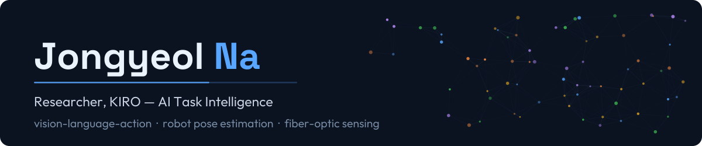
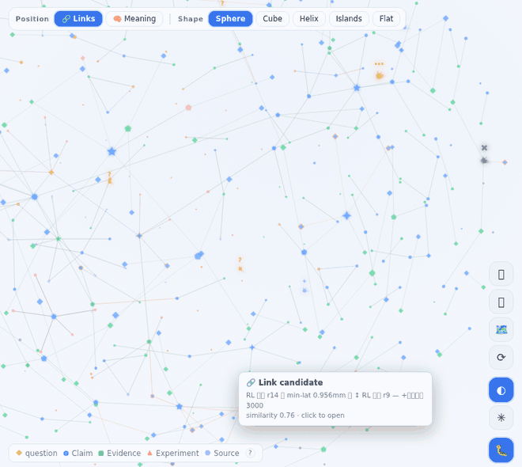

M.S. from DGIST, [Intelligent Robot OptoMechatronics (IROM) Lab](https://sites.google.com/view/dgist-irom/home).
I build vision-language-action policies for precision robot manipulation — and the sensing
stack that makes them trustworthy, because vision alone cannot tell you what a needle is
touching.

---

## 🔬 What I work on

| | Area | Focus |
|---|---|---|
| 🪡 | **Vision-Language-Action** | Meca500 R3 + eye-phantom needle insertion. Two generations: a Qwen3.5-VL (2B) pipeline with fused OCT/FPI sensing, then a full reboot on LeRobot (SmolVLA · ACT · Diffusion · π0), plus a MuJoCo sim twin. |
| 🤖 | **Robot pose estimation** | Monocular and multi-view robot pose from a *frozen* DINO backbone — one set of weights across arms, no real-world training. Meca500 · FR5 · Franka · Baxter. |
| 🔦 | **Fiber-optic sensing** | EFPI interferometry and OCT for needle-tip state: phase unwrapping, layer detection, puncture-curve classification. |
| 🦾 | **Foundation policies** | Bimanual 16-DoF manipulation corpus — 52 datasets, 23k episodes, 10.3M frames — and the multi-GPU pipeline that trains on it. |

**Recent** — *Precision enhancement of epidural force-sensing needle with machine learning*,
Int. J. Optomechatronics **20**(1) 2026 (SCIE) · first-author papers at **KRoC 2025** and
**IEIE 2025** · co-author at **IROS**. Full list in the [CV](CV.md).

## 📚 Open knowledge graph

I keep my research as a **discourse graph** — every claim carries the evidence that
supports it, refuted approaches stay on the record, and open questions are first-class
nodes rather than TODOs.

### → **[najongs.github.io/knowledge-vault](https://najongs.github.io/knowledge-vault/)** — browse it live

*Recorded from the live site.* Every dot is a question, claim, evidence item, experiment
or source; every line is a typed relation between them. Refuted claims stay on the record
rather than being deleted — so the same experiment does not get run twice.

On the site the same graph can be re-projected as a cube, a helix or islands, or re-laid
by semantic similarity instead of links.

**Click the graph to explore it live.**

## 🧭 Code

### → **[`DINObotPose`](https://github.com/Najongs/DINObotPose)** `v1.0.0`

Monocular robot pose and joint-angle estimation with a pretrained vision foundation model
and kinematic fitting. Pinned dependencies, checkpoint SHA-256 manifest, environment
doctor, and one-command paper reproduction.

*The rest of my research repositories are private while the work is unpublished* —
VLA policies for needle insertion, the pose-estimation lineage, fibre-optic sensing,
and the data-collection and calibration tooling behind them. They open as the
corresponding papers do. The [portfolio](PORTFOLIO.md) describes what is in them.

> Superseded generations are **archived, not deleted** — a refuted approach is still a
> result, and each generation holds code that never made it into its successor.

## 🛠 Stack

**Hardware I run on** — Mecademic Meca500 R3 · Trossen WidowX AI (bimanual) ·
Pollen Reachy · FAIRINO FR5 · Franka · Stereolabs ZED · NVIDIA DGX-1 (8×V100)

## 📫 Reach me

<!--
Najongs/Najongs — this README renders on the profile page.
-->
